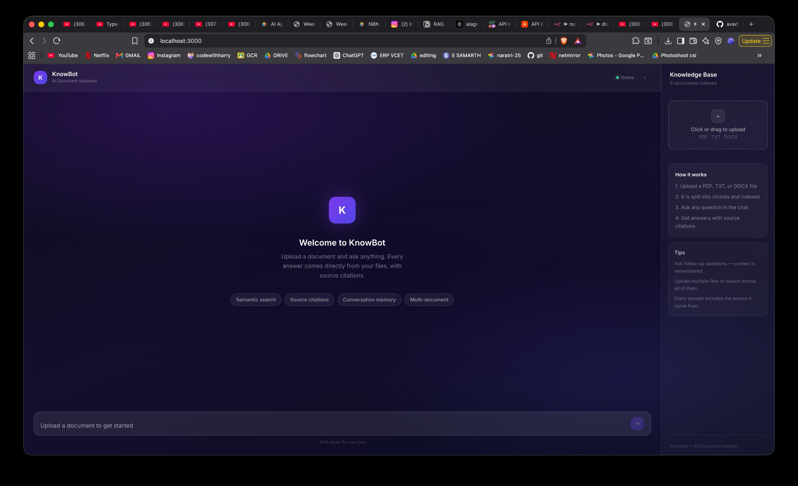
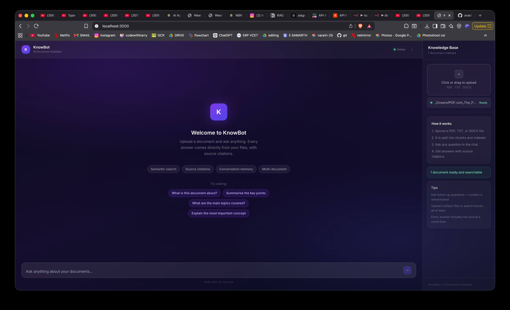
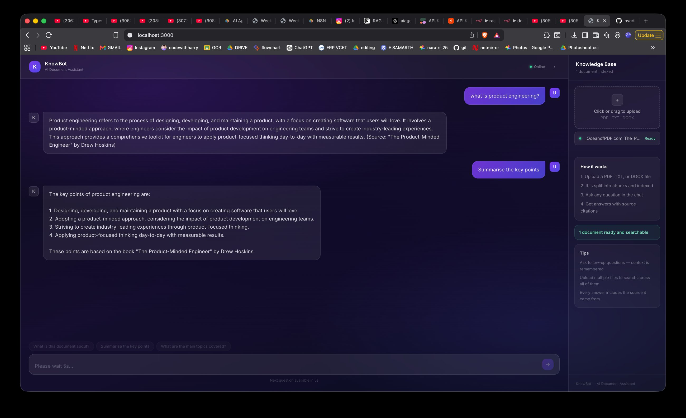

# KnowBot — AI Knowledge Assistant

A no-code AI-powered Knowledge Assistant built with **n8n**, **Groq**, **Pinecone**, and **Cohere**. Upload any document and have an intelligent conversation with it. Every answer is retrieved directly from your files and cited back to the source.

---

## Screenshots

### KnowBot UI


### Document Indexed & Ready


### Chat in Action


### n8n — Document Ingestion Workflow
.png>)

### n8n — RAG Chat Agent Workflow
.png>)

---

## Architecture

```
┌─────────────────────────────────────────────────────────────────┐
│                        USER (Browser)                           │
│                    KnowBot — Next.js Frontend                   │
└────────────┬────────────────────────────────┬───────────────────┘
             │ Upload document                │ Ask question
             ▼                               ▼
┌────────────────────────┐     ┌─────────────────────────────────┐
│   Next.js API Route    │     │      Next.js API Route          │
│   /api/upload          │     │      /api/chat                  │
│   (server-side proxy)  │     │      (server-side proxy)        │
└────────────┬───────────┘     └──────────────┬──────────────────┘
             │                                │
             ▼                               ▼
┌─────────────────────────────────────────────────────────────────┐
│                         n8n (No-Code Automation)                │
│                                                                 │
│  ┌─────────────────────────┐  ┌────────────────────────────┐   │
│  │  Workflow 1: Ingestion  │  │  Workflow 2: RAG Chat      │   │
│  │                         │  │                            │   │
│  │  Webhook Trigger        │  │  Chat Message Trigger      │   │
│  │       ↓                 │  │         ↓                  │   │
│  │  Pinecone Vector Store  │  │     AI Agent (Groq)        │   │
│  │  (upsert mode)          │  │         ↓                  │   │
│  │       ↓                 │  │  search_knowledge_base     │   │
│  │  Cohere Embeddings      │  │  (Pinecone retrieve)       │   │
│  │  embed-english-v3.0     │  │         ↓                  │   │
│  │  (1024-dim vectors)     │  │  Cohere Embeddings         │   │
│  └─────────────────────────┘  │         ↓                  │   │
│                               │  Simple Memory             │   │
│                               │  (conversation context)    │   │
│                               └────────────────────────────┘   │
└──────────────────────────┬──────────────────┬───────────────────┘
                           │                  │
                           ▼                  ▼
              ┌────────────────┐   ┌──────────────────────┐
              │   Pinecone     │   │    Groq (LLM)        │
              │  Vector DB     │   │  llama-3.3-70b       │
              │  (knowledge    │   │  -versatile          │
              │   store)       │   │                      │
              └────────────────┘   └──────────────────────┘
```

### Data Flow

**Document Upload:**
Browser → `/api/upload` → n8n Webhook → Cohere (embed) → Pinecone (store vectors)

**Chat Query:**
Browser → `/api/chat` → n8n Chat Webhook → AI Agent → Pinecone (retrieve top-k chunks) → Groq (generate answer with context) → Response with source citations

---

## Tech Stack

| Layer | Tool | Purpose |
|---|---|---|
| Frontend | Next.js 14 (JavaScript) | Chat UI and file upload interface |
| Automation | n8n (cloud) | No-code workflow orchestration |
| LLM | Groq — llama-3.3-70b-versatile | Answer generation |
| Vector DB | Pinecone | Storing and retrieving document embeddings |
| Embeddings | Cohere — embed-english-v3.0 | Converting text chunks to 1024-dim vectors |
| Memory | n8n Simple Memory | Multi-turn conversation context |

---

## Features

- **Document Upload** — supports PDF, TXT, and DOCX files
- **RAG (Retrieval-Augmented Generation)** — answers grounded in uploaded documents, not hallucinated
- **Source Citations** — every answer includes the document and page range it came from
- **Multi-turn Memory** — conversation context is retained across messages in a session
- **Multi-document Support** — upload multiple files and query across all of them
- **Semantic Search** — finds relevant chunks by meaning, not just keyword matching
- **Rate-limit Protection** — 10-second cooldown between queries to stay within Groq free tier limits
- **Clean Glassmorphism UI** — no backend details exposed to the user

---

## Project Structure

```
/
├── README.md
├── .gitignore
├── screenshots/                 # UI and workflow screenshots
├── n8n-workflows/
│   ├── document-ingestion.json  # Workflow: upload → embed → store
│   └── rag-agent.json           # Workflow: query → retrieve → answer
└── frontend/                    # Next.js app
    ├── app/
    │   ├── layout.jsx
    │   ├── page.jsx             # Main chat + upload UI
    │   ├── globals.css          # Glassmorphism styles
    │   └── api/
    │       ├── chat/route.js    # Proxies questions to n8n
    │       └── upload/route.js  # Proxies file uploads to n8n
    ├── components/
    │   ├── MessageBubble.jsx
    │   └── UploadZone.jsx
    ├── .env.local.example
    ├── jsconfig.json
    └── package.json
```

---

## Setup Guide

### Prerequisites

- [n8n cloud account](https://app.n8n.cloud) (free tier works)
- [Groq API key](https://console.groq.com) (free)
- [Pinecone account](https://pinecone.io) (free tier — 1 index)
- [Cohere API key](https://cohere.com) (free tier)
- Node.js 18+ installed locally

---

### Step 1 — Pinecone Setup

1. Create a free account at [pinecone.io](https://pinecone.io)
2. Create a new index:
   - **Name:** `knowledge-base`
   - **Dimensions:** `1024`
   - **Metric:** `cosine`
3. Copy your API key

---

### Step 2 — n8n Workflows

1. Log in to [n8n cloud](https://app.n8n.cloud)
2. Import `n8n-workflows/document-ingestion.json` as a new workflow
3. Import `n8n-workflows/rag-agent.json` as a new workflow
4. Add credentials in each workflow: Groq (gsk_ key), Pinecone, Cohere
5. Ingestion workflow: set Webhook path to `ingest`, Respond to "When last node finishes" → **Activate**
6. Chat workflow: open "When chat message received" → enable **Make Chat Publicly Available** → copy the URL → **Publish**

---

### Step 3 — Frontend Setup

```bash
cd frontend
npm install
cp .env.local.example .env.local
```

Edit `.env.local`:

```env
INGEST_WEBHOOK_URL=https://your-instance.app.n8n.cloud/webhook/ingest
CHAT_WEBHOOK_URL=https://your-instance.app.n8n.cloud/webhook/YOUR-UUID/chat
```

Run locally:

```bash
npm run dev
```

Open [http://localhost:3000](http://localhost:3000)

---

### Step 4 — Test It

1. Click **Upload a document** and select a PDF
2. Wait for status to show **Ready**
3. Ask a question about the document
4. Get an answer with source citations

---

## n8n Workflow Configuration

### AI Agent System Prompt

```
You are KnowBot, a document assistant. Answer only from the knowledge base.

Rules:
- Search before every new question
- Synthesize results into a clear answer
- Cite the source document
- For follow-ups ("in 3 points", "explain more") reuse previous answer, don't search again
- If nothing found, say "I couldn't find this in the uploaded documents"
```

### Key Node Settings

| Node | Setting |
|---|---|
| Groq Chat Model | `llama-3.3-70b-versatile` |
| Pinecone (Tool) | Name: `search_knowledge_base`, Mode: Retrieve, Top K: 4 |
| Cohere Embeddings | `embed-english-v3.0` |
| Simple Memory | Context Window: 3 messages |

---

## Environment Variables

| Variable | Description |
|---|---|
| `INGEST_WEBHOOK_URL` | n8n webhook URL for document ingestion |
| `CHAT_WEBHOOK_URL` | n8n public chat webhook URL |

Server-side only — never exposed to the browser.

---

## Known Limitations

- Groq free tier: ~6,000 tokens/minute. The 10s cooldown handles this.
- Pinecone free tier: 1 index, ~100k vectors
- Large PDFs may take a few seconds to index

---

## License

MIT
